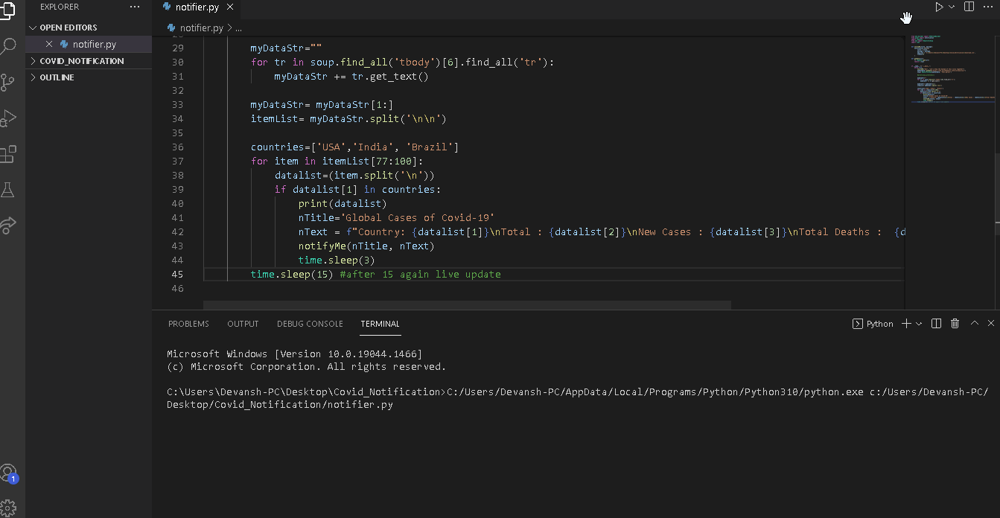

# Covid-Notifier-Python
Gives daily updates of covid spread in the top 3 worst hit countries US, India and Brazil

**Desktop Remover** is a python tool which can give daily updates like news, covid status, reminders etc. It is very much similar to reminder clock which reminds the user about an activity he or she wants to perform. (Like a task manager)

Submitted by: **Devansh Goel**

Time spent: **3-4** hours spent in total

## User Stories

The following **required** functionality is completed:

* [x] User can **Add his own task and function it as a reminder**
* [x] User can **use it as a clock which consists of features as a timer and alarm**
* [x] User can **stay up to date by linking it with a news website or stock market or even as a covid daily updater**
* [x] User can **safely exit the program** 

## Video Walkthrough

Here's a walkthrough of implemented user stories:

GIF created with [LiceCap](http://www.cockos.com/licecap/).

## Notes

It was great to use different libraries like BeautifulSoup and HTML sourcing.

## License

    Copyright [2021] [Devansh]

    Licensed under the Apache License, Version 2.0 (the "License");
    you may not use this file except in compliance with the License.
    You may obtain a copy of the License at

        http://www.apache.org/licenses/LICENSE-2.0

    Unless required by applicable law or agreed to in writing, software
    distributed under the License is distributed on an "AS IS" BASIS,
    WITHOUT WARRANTIES OR CONDITIONS OF ANY KIND, either express or implied.
    See the License for the specific language governing permissions and
    limitations under the License.
